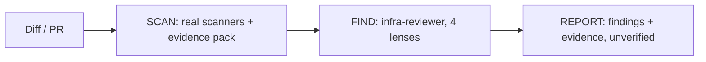

# Singularity Review

[](https://github.com/vamshivardhan01/singularity-review/actions/workflows/ci.yml)

Infra-specific code review for Claude Code, Kiro, and Codex: Terraform, Helm, Kubernetes, ArgoCD/GitOps, AWS IAM.

## Executive Summary

- **Problem:** Generic AI review skills look for app-code bugs (XSS, N+1 queries). They have no concept of Terraform destroy/replace, ArgoCD prune, or SCP lockout, so they report "no issues" on infra changes that are actually dangerous.
- **What it does:** Detects the stack from file structure, then runs SCAN (real scanners) → FIND (one reviewer agent, four lenses) → REPORT. Ships as evidence for the author to confirm, not an adjudicated verdict.
- **Current state:** Four separate reviewer personas were measured and merged into one agent after they proved redundant (see Key Decisions). The adversarial VERIFY step is currently disabled by config, its kill rate didn't justify its cost, so every finding ships unverified and clearly labeled as such.
- **Trade-off:** You're accepting findings that haven't been independently checked, in exchange for a cheaper, faster review. The system says so in every report; it doesn't hide it.
- **Try it:** `bash install.sh`, then ask Claude to "review this PR."

## How It Works



- **SCAN** runs real tools first (`checkov`, `kube-score`, `terraform plan`, etc.) and builds one shared evidence pack, so four lenses don't each re-render the same chart.
- **FIND** is one agent (`infra-reviewer.md`), not four. It runs four lenses, one pass over the whole diff (`BROAD`), then a focused pass only where something was flagged (`DEEP`). Large diffs use a two-stage triage instead of narrowing scope, see Key Decisions.
- **VERIFY is off.** `adversarial-verifier.md` still exists and is one config change from re-enabled; right now FIND absorbs its safety-critical jobs (counter-case search, evidence requirement) directly.
- **REPORT** applies a shared severity table, caps low-priority noise, and never applies, syncs, or modifies anything.

| Lens | Core question |
|---|---|
| Platform | What does this destroy or replace, and what happens on the *second* apply? |
| Architecture | Who consumes this, and what breaks when it changes? |
| SRE | How does this page someone at 3am? Is there a test catching it before prod? |
| Backend | Is this operation safe to run twice? |

See the [Architecture Deep Dive](https://github.com/vamshivardhan01/singularity-review/wiki/Architecture-Deep-Dive) wiki page for what each lens owns and asks in full.

## Key Decisions

| Decision | Why | Evidence |
|---|---|---|
| Four personas → one agent, four lenses | On one PR, 3 of 4 personas independently found the same issue (3x cost, 1 finding). On another, one merged agent found 24 candidates across the whole diff for 57k tokens; four separate personas found 8 across a tenth of it for 150k tokens. | `agents/infra-reviewer.md`, superseded persona files removed |
| VERIFY disabled | Measured kill rate: 1-in-10. It was ~30-40% of run cost for a low yield. Its other jobs (counter-case search, evidence bar) moved to FIND. | `skills/singularity-review/SKILL.md` Phase 3 |
| Triage FIND instead of narrowing scope on large diffs | Narrowing a 3,285-line PR reviewed ~10% of it for 150k tokens. Triage (cheap flag pass, then depth only where flagged) keeps 100% detection coverage; only proof-depth is staged. | `references/review-scaling.md` |
| Shared evidence pack, built once | FIND agents were spending 10-15 of ~25 tool calls re-rendering the same chart before any role-specific reasoning started. | `skills/singularity-review/SKILL.md` Phase 1 |
| Evidence pack handed as summary, not read in full | On a real run, one agent that read the full pack up front amortized the cost and dropped 18.8%; another carried it 17 turns and got 4.5% *more* expensive despite fewer tool calls. | same |
| Dropped `tfsec`/`terrascan`/`datree` from scanners | All three are archived/deprecated; running them gives a stale rule set and false confidence. | `references/scanners.md` |

## Getting Started

**Claude Code:**
```bash
npx @vamshivardhan01/singularity-review
```
Symlinks skills/agents/hooks into `~/.claude` and merges (never overwrites) hook entries into `settings.json`. Idempotent, safe to re-run. Requires Node 18+. macOS/Linux (Windows: use WSL). No install needed — `npx` runs it directly; `npm i -g @vamshivardhan01/singularity-review` if you want the `singularity-review` command kept around. Cloned the repo instead of using npm? `bash install.sh` does the same thing.

**Kiro:** ready agent config at `kiro/singularity-review.json`.
```bash
ln -sf "$PWD/kiro/singularity-review.json" ~/.kiro/agents/singularity-review.json
kiro-cli chat --agent singularity-review
```

**Codex or any other agent:** the portable core is skills + references + scanner scripts (plain markdown + shell). Point the agent at them via its instructions file and let it call `detect-stack.sh` / `scan-*.sh` directly. No sub-agent primitive → run the lenses as sequential passes instead of spawns.

**Using it:** "review this PR" runs SCAN → FIND → REPORT and only reports findings with evidence attached. "post these" (after reviewing the report) invokes `posting-review-comments`, which shows numbered findings and waits for you to pick which go live. Nothing reaches GitHub without an explicit choice.

## Hooks (Claude Code)

| Hook | Event | Behavior |
|---|---|---|
| `guard.js` | `PreToolUse(Bash)` | Hard-denies a short list of irreversible commands (`terraform destroy`, unsaved-plan apply, `kubectl delete ns/pv`, force-push to main, `argocd app delete`, `s3 rb`). The only hard block in the system; everything else is advisory. |
| `scan-on-write.js` | `PostToolUse(Write\|Edit)` | Fast fmt/lint check on infra file writes, debounced 30s per file. |
| `charter-inject.js` | `SessionStart` | One pointer to the skill, once per session. |
| `stack-switch-inject.js` | `UserPromptSubmit` | Emits only when the detected stack changes mid-session. |
| `drift-watch.js` | `UserPromptSubmit` | Suggests a fresh session when edit churn or failures climb past a threshold. |
| `mistake-ledger.js` | `PostToolUseFailure`, `PostToolUse` | Write-only; feeds `drift-watch` and handoff docs. |

## Risks

- **Stack detection is heuristic** (file markers like `.tf`, `Chart.yaml`), walked from the nearest Git root. An unconventional repo layout can be misdetected.
- **VERIFY off means over-confident findings are the risk, not missed ones.** Every report says so explicitly, but it depends on the author actually reading that line.
- **The prefilter trades a little recall for cost.** Its rule is "spawn when unsure," but an edge-case diff could in principle skip a lens that would have caught something. `paranoid` tier exists to remove this when it matters.
- **Oracle coverage depends on installed tooling.** Missing `terraform`/`helm`/`kube-score` means a skipped check, logged as a gap, not silently replaced with guesswork.

## Testing This Tool

`skills/singularity-review/eval/` is a small golden dataset: real PRs with confirmed ground truth, used to check that a change to the agent or skill files doesn't regress what it catches. Currently 2 cases; see `eval/README.md` for how to add more and what shapes are still missing.

## Contributing

PRs need one approval (via [`CODEOWNERS`](.github/CODEOWNERS)) and a green [CI run](.github/workflows/ci.yml) before they merge into `main` — see [CONTRIBUTING.md](CONTRIBUTING.md) for the dev workflow and [CODE_OF_CONDUCT.md](CODE_OF_CONDUCT.md). Found a security issue? See [SECURITY.md](SECURITY.md) instead of opening a public issue. Deeper design rationale and open questions live on the [wiki](https://github.com/vamshivardhan01/singularity-review/wiki).

## Repo Layout

```
skills/singularity-review/   review-time skill: SCAN -> FIND -> REPORT, plus eval/
skills/building-platform-code/  write-time skill: same 4 lenses, applied before code is written
skills/handing-off-context/     reads the mistake ledger, writes a resumable handoff doc
skills/posting-review-comments/ posts a user-selected subset of findings as PR comments
agents/                      infra-reviewer.md (active) + adversarial-verifier.md (retained, unused)
references/                  stack-specific failure taxonomies + shared severity/scaling rules
hooks/singularity-review/    6 Claude Code hooks (see Hooks table above)
research/findings.md         design lessons from real runs, each tied to a concrete change above
kiro/, settings.snippet.json install configs for Kiro and Claude Code
bin/cli.js                   the installer (Node stdlib only, no dependencies)
install.sh                   thin bash shim -> bin/cli.js, for non-npm clones
wiki/                        source for the GitHub wiki, synced to it on merge to main
.github/                     CI, issue/PR templates, CODEOWNERS, dependabot
```

## License

Apache-2.0 — see [`LICENSE`](LICENSE).
