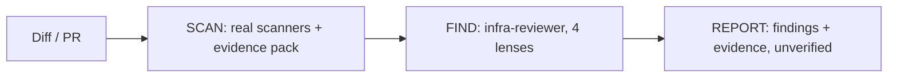

# Singularity Review

[](https://github.com/vamshivardhan01/singularity-review/actions/workflows/ci.yml)
[](https://www.npmjs.com/package/@vamshivardhan01/singularity-review)
[](package.json)
[](LICENSE)

Infra-specific code review for Claude Code, Kiro, and Codex: Terraform, Helm, Kubernetes, ArgoCD/GitOps, AWS IAM.

Built by a platform engineer who runs Terraform, Helm, and ArgoCD against real production AWS/Kubernetes infrastructure day to day — this exists because the generic AI reviewers I actually used at work kept saying "no issues" on diffs that would have paged someone at 3am. Generic code-review skills are tuned for app code — XSS, N+1 queries, null checks. They have no concept of `terraform destroy`, an ArgoCD `prune`, or an SCP lockout, so they wave infra changes through that aren't actually safe. *(Bio draft — replace with your own wording/specifics before merge; see the PR description.)*

## Contents
- [See It Catch Something](#see-it-catch-something)
- [How It Works](#how-it-works)
- [Key Decisions](#key-decisions)
- [Compared to Generic AI Reviewers](#compared-to-generic-ai-reviewers)
- [Getting Started](#getting-started)
- [What Access It Needs](#what-access-it-needs)
- [Hooks (Claude Code)](#hooks-claude-code)
- [Risks](#risks)
- [Testing This Tool](#testing-this-tool)
- [Contributing](#contributing)
- [Roadmap & FAQ](#roadmap--faq)
- [Repo Layout](#repo-layout)

## See It Catch Something

Real output, from this system's own [golden eval set](skills/singularity-review/eval/cases/pr68.md) (repo and chart names pseudonymized per [`CONTRIBUTING.md`](CONTRIBUTING.md); the RBAC grant, the failure mechanism, and the cold-start verification are a real run against a real PR):

> **[P1] ClusterRole grants `nodes/proxy` cluster-wide with no configured consumer** — `charts/otel-collector/templates/rbac.yaml:35`
> `get` on `nodes/proxy` authorizes the apiserver's kubelet-exec proxy path — container exec on any node, from this pod's service account token. The pipeline doesn't need it: `scrape_configs: []`, targets arrive as direct endpoints, no apiserver-proxy relabel config anywhere in the rendered output.
> ↳ caught by platform lens · adversarial-verifier CONFIRMED

> **[P1] Stock chart defaults render and apply cleanly but produce a permanently non-functional exporter** — `values.yaml:26-33`
> Confirmed against the actual pinned collector image: it reaches `Running`/ready, then retries every export forever (`unsupported protocol scheme ""`). No `required` guard, no schema. The warning that would catch this lives in `NOTES.txt`, which GitOps never renders — ArgoCD doesn't run `helm install`.
> ↳ caught by 3 independent lenses (convergence signal) · adversarial-verifier CONFIRMED

That's the pitch in two findings: a generic reviewer sees valid YAML and a chart that renders. This one asks what the ClusterRole actually authorizes, and whether the defaults actually work once applied — not just once linted.

## How It Works


```mermaid
flowchart LR
    A[Diff / PR] --> B[SCAN: real scanners + evidence pack]
    B --> C[FIND: infra-reviewer, 4 lenses]
    C --> D[REPORT: findings + evidence, unverified]
```

- **SCAN** runs real tools first (`checkov`, `kube-score`, `terraform plan`, etc.) and builds one shared evidence pack, so four lenses don't each re-render the same chart.
- **FIND** is one agent (`infra-reviewer.md`), not four. It runs four lenses, one pass over the whole diff (`BROAD`), then a focused pass only where something was flagged (`DEEP`). Large diffs use a two-stage triage instead of narrowing scope, see Key Decisions.
- **VERIFY is off.** `adversarial-verifier.md` still exists and is one config change from re-enabled; right now FIND absorbs its safety-critical jobs (counter-case search, evidence requirement) directly. Measured kill rate before it was disabled: 1-in-10 candidates, at ~30-40% of a run's total cost — a real number from the same eval set linked above, not a guess. That trade is in the Risks section below, not hidden.
- **REPORT** applies a shared severity table, caps low-priority noise, and never applies, syncs, or modifies anything.

| Lens | Core question |
|---|---|
| Platform | What does this destroy or replace, and what happens on the *second* apply? |
| Architecture | Who consumes this, and what breaks when it changes? |
| SRE | How does this page someone at 3am? Is there a test catching it before prod? |
| Backend | Is this operation safe to run twice? |

See the [Architecture Deep Dive](https://github.com/vamshivardhan01/singularity-review/wiki/Architecture-Deep-Dive) wiki page for what each lens owns and asks in full.

## Key Decisions

| Decision | Why | Evidence |
|---|---|---|
| Four personas → one agent, four lenses | On one PR, 3 of 4 personas independently found the same issue (3x cost, 1 finding). On another, one merged agent found 24 candidates across the whole diff for 57k tokens; four separate personas found 8 across a tenth of it for 150k tokens. | `agents/infra-reviewer.md`, superseded persona files removed |
| VERIFY disabled | Measured kill rate: 1-in-10. It was ~30-40% of run cost for a low yield. Its other jobs (counter-case search, evidence bar) moved to FIND. | `skills/singularity-review/SKILL.md` Phase 3 |
| Triage FIND instead of narrowing scope on large diffs | Narrowing a 3,285-line PR reviewed ~10% of it for 150k tokens. Triage (cheap flag pass, then depth only where flagged) keeps 100% detection coverage; only proof-depth is staged. | `references/review-scaling.md` |
| Shared evidence pack, built once | FIND agents were spending 10-15 of ~25 tool calls re-rendering the same chart before any role-specific reasoning started. | `skills/singularity-review/SKILL.md` Phase 1 |
| Evidence pack handed as summary, not read in full | On a real run, one agent that read the full pack up front amortized the cost and dropped 18.8%; another carried it 17 turns and got 4.5% *more* expensive despite fewer tool calls. | same |
| Dropped `tfsec`/`terrascan`/`datree` from scanners | All three are archived/deprecated; running them gives a stale rule set and false confidence. | `references/scanners.md` |
| `kiro/singularity-review.json`'s deny list is generated, not hand-maintained | It drifted behind `guard.js`'s DENY_RULES once already (missing 3 rules from day one, never caught). `scripts/sync-kiro-deny-list.js` generates it and CI fails if it's out of sync. | `scripts/sync-kiro-deny-list.js` |

All PR/repo identifiers above are pseudonyms from this system's own eval set (see [Testing This Tool](#testing-this-tool)) — real numbers, fictional names, per `CONTRIBUTING.md`.

## Compared to Generic AI Reviewers

CodeRabbit, Greptile, and PR-Agent are all real, useful tools — none of them are built around infra as a first-class concern, and it shows in what they're actually optimized to catch:

| | Generic AI reviewers (CodeRabbit, Greptile, PR-Agent) | Singularity Review |
|---|---|---|
| **Trained/tuned for** | App code: style, common bug patterns, PR summarization across any language | Infra-specific failure classes: blast radius, RBAC over-grant, drift, sync behavior, IAM trust boundaries |
| **Evidence behind a finding** | The model's read of the diff | A real scanner/oracle run first (`terraform validate`, `helm template \| kube-score`, `checkov`) — the model reasons over that output, not just the diff text |
| **Concept of "destroys state" vs. "adds a file"** | Not modeled — a `terraform destroy` and a comment typo are just two lines in a diff | A hard-coded, hook-level deny list blocks the genuinely irreversible commands regardless of what the model decides (`guard.js`) |
| **RBAC/IAM reasoning** | General "looks risky" pattern matching, if any | Explicit signal table distinguishing a genuine cluster-wide privilege-escalation grant from routine scoped RBAC (a real, measured cost bug this project hit and fixed — see Key Decisions) |
| **False-positive handling** | Varies by tool, generally a single pass | A mandatory counter-case search before any finding ships — actively looks for the guard/test/comment that would disprove its own finding |

None of this makes the generic tools worse at what they're for — reviewing app code, they're faster to set up and cover far more languages. This project doesn't compete with them there. It exists for the diffs where "does this compile and look reasonable" isn't the question that matters — "what does this destroy, and has anyone actually confirmed the alternative works" is.

## Getting Started

**Claude Code:**
```bash
npx @vamshivardhan01/singularity-review
```
Symlinks skills/agents/hooks into `~/.claude` and merges (never overwrites) hook entries into `settings.json`. Idempotent, safe to re-run. Requires Node 18+. macOS/Linux natively; on Windows, run it inside WSL2 — the installer relies on symlinks, which need Developer Mode or WSL to create reliably. No install needed — `npx` runs it directly; `npm i -g @vamshivardhan01/singularity-review` if you want the `singularity-review` command kept around. Cloned the repo instead of using npm? `bash install.sh` does the same thing.

**Kiro:** the same installer sets up Kiro too, if it detects `~/.kiro` already exists (install Kiro first). It symlinks the skills into `~/.kiro/skills` and writes a rendered agent config to `~/.kiro/agents/singularity-review.json` — the resource paths in `kiro/singularity-review.json` are a `{{KIRO_DIR}}` template, not a real path, so don't symlink that file directly; let the installer render it:
```bash
npx @vamshivardhan01/singularity-review
kiro-cli chat --agent singularity-review
```

**Codex or any other agent:** the portable core is skills + references + scanner scripts (plain markdown + shell). Point the agent at them via its instructions file and let it call `detect-stack.sh` / `scan-*.sh` directly. No sub-agent primitive → run the lenses as sequential passes instead of spawns.

**Using it:** "review this PR" runs SCAN → FIND → REPORT and only reports findings with evidence attached. "post these" (after reviewing the report) invokes `posting-review-comments`, which shows numbered findings and waits for you to pick which go live. Nothing reaches GitHub without an explicit choice.

## What Access It Needs

- **Local scanners** (`terraform`, `checkov`, `kube-score`, etc.) run read-only against your working tree — plan/render/lint, never apply. `bin/cli.js` reports which ones are missing on install; it doesn't install them for you.
- **The Kiro agent config lists `use_aws` as an available tool** — a few checks do call live, read-only AWS APIs (for example, confirming an instance type actually exists in a target region, the kind of thing a static scan can't tell you). It's never given `create`/`apply`/`delete`-shaped permissions, and it never should be: grant it a read-only IAM policy.
- **`guard.js` hard-blocks the genuinely destructive commands regardless of what the model decides to do** (`terraform destroy`, an unplanned apply, `kubectl delete ns/pv`, a force-push to main, `argocd app delete`, `aws s3 rb`) — see the Hooks table below. That's the actual backstop, not "the model wouldn't do that."

## Hooks (Claude Code)

| Hook | Event | Behavior |
|---|---|---|
| `guard.js` | `PreToolUse(Bash)` | Hard-denies a short list of irreversible commands (`terraform destroy`, unsaved-plan apply, `kubectl delete ns/pv`, force-push to main, `argocd app delete`, `s3 rb`), and **asks** (doesn't silently allow) when a command mixes shell expansion (`$(...)`, `` ` ``, `${...}`, a bare `$VAR`) with one of those same keywords, since a deny rule can't reliably match an unresolved expansion. The only hard block in the system; everything else is advisory. |
| `scan-on-write.js` | `PostToolUse(Write\|Edit)` | Fast fmt/lint check on infra file writes, debounced 30s per file. |
| `charter-inject.js` | `SessionStart` | One pointer to the skill, once per session. |
| `stack-switch-inject.js` | `UserPromptSubmit` | Emits only when the detected stack changes mid-session. |
| `drift-watch.js` | `UserPromptSubmit` | Suggests a fresh session when edit churn or failures climb past a threshold. |
| `mistake-ledger.js` | `PostToolUseFailure`, `PostToolUse` | Write-only; feeds `drift-watch` and handoff docs. |

## Risks

- **Stack detection is heuristic** (file markers like `.tf`, `Chart.yaml`), walked from the nearest Git root. An unconventional repo layout can be misdetected.
- **VERIFY off means over-confident findings are the risk, not missed ones.** Every report says so explicitly, but it depends on the author actually reading that line.
- **The prefilter trades a little recall for cost.** Its rule is "spawn when unsure," but an edge-case diff could in principle skip a lens that would have caught something. `paranoid` tier exists to remove this when it matters.
- **Oracle coverage depends on installed tooling.** Missing `terraform`/`helm`/`kube-score` means a skipped check, logged as a gap, not silently replaced with guesswork.
- **`guard.js`'s deny rules are a text match, not a shell interpreter.** Shell expansion that can't be resolved without actually running a subshell degrades to an `ask`, not a `deny` — see the Hooks table. Kiro's equivalent deny list has the same limitation, plus a narrower one: it has no equivalent for the 3 of `guard.js`'s rules that need a predicate rather than a regex (bare `terraform apply` without a saved plan, a stale plan file, force-push specifically to main/master) — see `scripts/sync-kiro-deny-list.js`.
- **It's a solo-maintained project.** `CODEOWNERS` requires one approval on every PR, which today means the maintainer approving their own PRs — that's honest about the current state, not a process that's pretending to be bigger than it is. Real outside review is welcome; see Contributing below.

## Testing This Tool

`skills/singularity-review/eval/` is a small golden dataset: real PRs (repo names pseudonymized, per `CONTRIBUTING.md`) with confirmed ground truth, used to check that a change to the agent or skill files doesn't regress what it catches. Currently 2 cases — the sample in [See It Catch Something](#see-it-catch-something) is pulled directly from one of them; see `eval/README.md` for how to add more and what shapes are still missing. This is the single biggest open reliability gap in the project: every cost/effectiveness tuning decision in the Key Decisions table was reasoned from architecture, and only a couple of them have a regression case backing them. More cases > more features, right now.

`tests/guard.test.js` is a plain regression table (no framework, 48 cases) for `guard.js`'s DENY_RULES matching logic — the exact code class that produced a P0 finding (every hard-deny rule bypassable via shell expansion) with zero coverage to catch it. Includes real-filesystem cases for the stale-plan-file predicate specifically, after an earlier version of this suite passed every case with `cwd: null` and never actually exercised it. Run: `node tests/guard.test.js`. Wired into CI.

## Contributing

PRs need one approval (via [`CODEOWNERS`](.github/CODEOWNERS)) and a green [CI run](.github/workflows/ci.yml) before they merge into `main` — see [CONTRIBUTING.md](CONTRIBUTING.md) for the dev workflow and [CODE_OF_CONDUCT.md](CODE_OF_CONDUCT.md). Found a security issue? See [SECURITY.md](SECURITY.md) instead of opening a public issue.

**First time here?** The fastest way to help right now isn't a PR — it's running this against a real diff and [opening an issue](https://github.com/vamshivardhan01/singularity-review/issues/new) with what it missed or got wrong. The eval dataset (2 cases as of this writing — see Testing This Tool above) grows from exactly that kind of report, not from more features.

## Roadmap & FAQ

Deeper design rationale and open questions live on the wiki, not buried in commit history:
- [Roadmap](https://github.com/vamshivardhan01/singularity-review/wiki/Roadmap) — the open items this project's own evidence-first rule is currently blocking on, in rough priority order (growing the eval dataset past 2 cases is #1).
- [FAQ](https://github.com/vamshivardhan01/singularity-review/wiki/FAQ) — why VERIFY is off by default, why one merged agent instead of four personas, common install issues, and how tiering actually gets decided.

## Repo Layout

```
skills/singularity-review/   review-time skill: SCAN -> FIND -> REPORT, plus eval/
skills/building-platform-code/  write-time skill: same 4 lenses, applied before code is written
skills/handing-off-context/     reads the mistake ledger, writes a resumable handoff doc
skills/posting-review-comments/ posts a user-selected subset of findings as PR comments
agents/                      infra-reviewer.md (active) + adversarial-verifier.md (retained, unused)
references/                  stack-specific failure taxonomies + shared severity/scaling rules
hooks/singularity-review/    6 Claude Code hooks (see Hooks table above)
tests/                       guard.js regression table, run in CI
scripts/                     sync-kiro-deny-list.js — keeps kiro/'s deny list generated from guard.js
research/findings.md         design lessons from real, pseudonymized runs, each tied to a concrete change above
kiro/, settings.snippet.json install configs for Kiro and Claude Code (kiro/singularity-review.json is a {{KIRO_DIR}} template, rendered by bin/cli.js)
bin/cli.js                   the installer (Node stdlib only, no dependencies)
install.sh                   thin bash shim -> bin/cli.js, for non-npm clones
wiki/                        source for the GitHub wiki, synced to it on merge to main
.github/                     CI, issue/PR templates, CODEOWNERS, dependabot
```

## License

Apache-2.0 — see [`LICENSE`](LICENSE).
