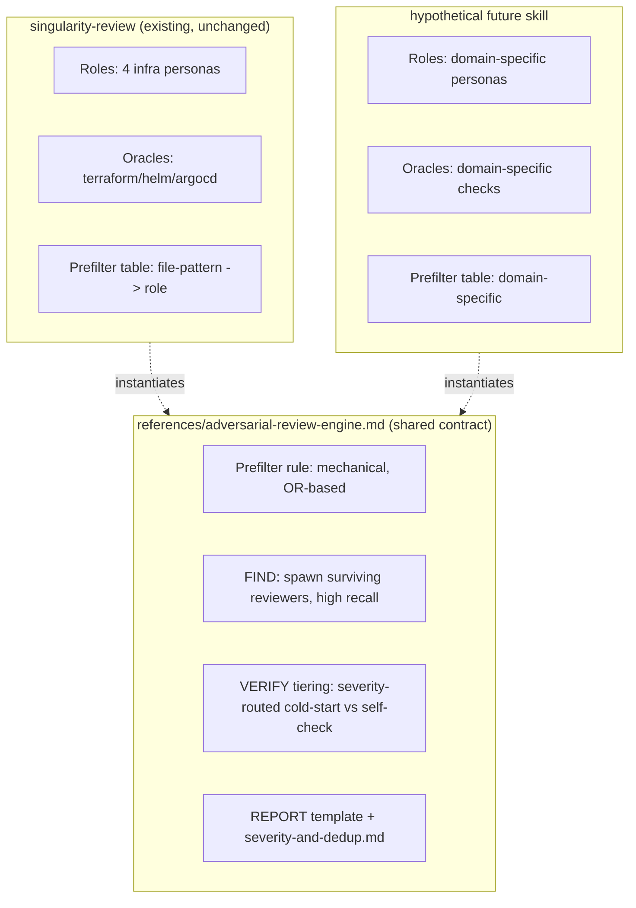

# Adversarial Review Engine — Extraction Design

**Type:** Design Document
**Status:** Proposed — scoped, not implemented. Requires sign-off before any skill files change.
**Audience:** Whoever decides whether/when to generalize `singularity-review`'s loop beyond platform engineering.

## Executive Summary

`singularity-review` implements a domain-agnostic pattern — FIND (high recall) → VERIFY (cold-start adversarial, oracle-gated) → REPORT (calibrated severity) — but hardcodes it to four infra-specific roles and infra-specific oracles. The pattern itself (from [arXiv:2604.19049](https://arxiv.org/abs/2604.19049)) has no dependency on infrastructure; it would work identically for reviewing SQL migrations, API contract changes, or any domain with (a) multiple legitimate reviewer perspectives and (b) some form of checkable ground truth.

- **Proposal:** extract the four-phase loop into a shared engine (`references/adversarial-review-engine.md` + a thin orchestration contract), parameterized by a *role set* and an *oracle set*, and make `singularity-review` one named instantiation of it rather than the only implementation.
- **Scope of this document:** design only. No new skill is created, no existing file changes as a result of this doc. This is the decision record for *whether* to do the extraction and *how*, not the extraction itself.
- **Recommendation:** proceed, but as an additive move — extract the shared contract into `references/`, leave `singularity-review/SKILL.md` fully intact and working exactly as today, and treat "does a second domain actually use this" as the real validation, not a hypothetical.

## Background

Today, the FIND→VERIFY→REPORT logic lives entirely inside `skills/singularity-review/SKILL.md`, written in terms of `platform-engineer`/`solutions-architect`/`devops-sre`/`backend-engineer` and terraform/helm/argocd oracles. Nothing about the *shape* of the loop — spawn N reviewer perspectives, cold-start-verify each candidate against a checkable ground truth, calibrate severity, dedup — requires those specific roles or that specific domain. The severity/dedup rules were already proven domain-neutral in the prior extraction pass (`references/severity-and-dedup.md`); this document asks whether the rest of the loop should follow.

## Problem Statement

If a second review domain is ever wanted (this system's user has explicitly said no new IaC stacks for now, but the *pattern* — not stack support — is separately reusable for non-infra domains), the only way to get it today is to copy `singularity-review/SKILL.md` wholesale and hand-edit every phase. That duplicates the FIND/VERIFY/REPORT logic, the tier system, and the prefilter mechanism just added — meaning a future bug fix or cost optimization (like today's role-prefilter or VERIFY-tiering) would need to be made twice, in two skills that have silently drifted apart, exactly the kind of divergence already found and fixed once this session between `lib.js` and `detect-stack.sh`.

## Goals / Non-goals

**Goals**
- Make the FIND→VERIFY→REPORT loop's *mechanics* (spawn logic, tiering rules, dedup, report template) definable once and referenced by any number of domain-specific skills.
- Preserve `singularity-review` as a fully working skill throughout — this is not a rewrite of the existing skill, it's a parallel extraction that the skill can optionally adopt.
- Keep the extraction additive: existing behavior, existing file paths referenced by hooks/agents, and existing REPORT format for `singularity-review` do not change as a result of this doc.

**Non-goals**
- Not building a second domain's role set/agents (SQL review, API review, etc.) — no evidence yet that a second domain is wanted. This doc scopes the mechanism, not a second consumer.
- Not changing `singularity-review`'s existing four roles, oracles, or file structure.
- Not touching the hooks (`guard.js`, `lib.js`, etc.) — those are already domain-agnostic infrastructure-of-the-tool, unaffected by this extraction.

## Proposed Architecture

### What gets extracted vs. what stays domain-specific

| Layer | Stays domain-specific (per-skill) | Becomes shared (`references/adversarial-review-engine.md`) |
|---|---|---|
| Roles | Yes — `platform-engineer` etc. are infra-specific personas | No — the engine doc defines *how many roles, how they're prefiltered*, not *which* roles |
| Oracles | Yes — `terraform plan`, `kube-score` are infra-specific | No — the engine doc defines *the oracle-gating rule* ("no CONFIRMED verdict, no REPORT"), not which command to run |
| Prefilter mechanism | Table contents are domain-specific (file-pattern → role mapping) | The *rule* ("deterministic, mechanical, OR-based, default-to-spawn-when-unsure") is shared |
| VERIFY tiering | Severity thresholds could vary by domain | The *tiering logic* (route by provisional severity, cold-start vs. self-check) is shared |
| Severity/dedup | N/A — already fully shared | Already done (`severity-and-dedup.md`) |
| REPORT template | Field names may vary (`role:` vs. some other attribution label) | The *template shape* (summary → scan/prefilter/find/verify counts → findings → no-findings/killed lines) is shared |

### Data flow (proposed)

`singularity-review/SKILL.md` would gain one line pointing at the engine doc for the *mechanics* it already implements, but its own Phase 1–4 sections stay as the authoritative, concrete instructions for this domain — the engine doc doesn't replace them, it documents the pattern they're an instance of, for the benefit of a second skill that wants to reuse it.

### Migration path (if approved)

1. Write `references/adversarial-review-engine.md` — extract the *mechanics* prose (prefilter rule, tiering rule, report template shape) from `singularity-review/SKILL.md` into domain-neutral language, using `[ROLE]`/`[ORACLE]` placeholders instead of the four named agents.
2. Add one cross-reference line to `singularity-review/SKILL.md`: "This skill instantiates the pattern in `references/adversarial-review-engine.md` with platform-engineering roles and infra oracles." No other change to that file.
3. Do not build a second skill speculatively. Wait until an actual second domain is requested, then write that skill's roles/oracles/prefilter table only — the mechanics are already documented and don't need re-deriving.

## Risks / Limitations

- **Premature abstraction risk**: extracting a shared contract before a second consumer exists means the abstraction is unvalidated — the "right" level of parameterization (is severity-tiering threshold really universal, or infra-specific?) is a guess until a second domain actually stresses it. Mitigated by keeping the extraction docs-only (no code/schema to get wrong) and by explicitly not touching `singularity-review`'s working implementation.
- **Maintenance surface increases by one file** — `adversarial-review-engine.md` needs to stay in sync with `singularity-review/SKILL.md` if the latter's mechanics change (e.g., if the prefilter rule's "default to spawn when unsure" principle is later revised). This is the same class of drift risk already seen once between `lib.js`/`detect-stack.sh` — worth a periodic manual check, not automated tooling, given this is a two-file relationship, not a five-file one.
- **No measured cost/reuse benefit yet** — this document is speculative value until a second domain exists to prove the abstraction saves the work it claims to save.

## Recommendation

Approve the extraction as scoped above **only when there is an actual second domain to instantiate it** — writing `adversarial-review-engine.md` today, with no second consumer, would be documentation for a framework with one user, which is the same premature-abstraction risk called out above. Recommended trigger: the next time a genuinely different review domain is wanted (not a new IaC stack — the user has explicitly deprioritized that — but a structurally different domain like SQL migrations or API contracts), do the extraction *then*, informed by that real second use case, rather than guessing the right shape now.

Until that trigger, `singularity-review/SKILL.md` remains the single source of truth for this pattern, and the severity/dedup extraction already completed (`severity-and-dedup.md`) is the one piece of this design that's proven, since it's actually shared today (used identically by all five agent files).
